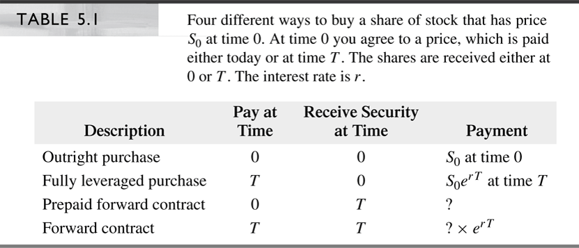
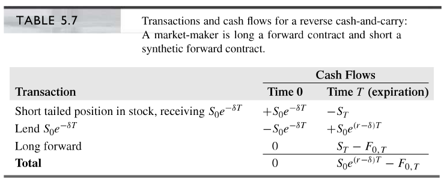

# __Chapter 5: Financial Forwards and Futures (Version 2.0)__

Finance 6470: Derivatives Markets \hfill\break
Tyler J. Brough \hfill\break
Last Update: February 20, 2020 \hfill\break

\vspace{10mm}

## Section 5.1: Alternative Ways to Buy a Stock

The purchase of XYZ stock has three components: 

1. Fixing the price

2. The buyer making payment to the seller

3. The seller transferring share ownership to the buyer

\vspace{6mm}

If we allow for the possibility that payment and physical receipt can occurr at different times (e.g. $t=0$ and $t=T$) then there are four possibilities for how to purchase XYZ shares: 

* __(1)__  __Outright Purchase:__ 
       - the typical way to buy stock (payment and physical receipt at $t=0$)

* __(2)__ __Fully Leveraged Purchase:__ 
    - Purchase by borrowing the entire purchase price
    - At $t=0$ get $S_{0}$
    - At $t=T$ pay $S_{0}e^{rT}$

* __(3)__ __Prepaid Forward Contract:__ 
    - Pay for stock today at $t=0$ at price $S_{0}$
    - Receive stock at $t=T$ worth $S_{T}$
        
* __(4)__ __Forward Contract:__ 
    - Both payment and physical receipt at $t=T$
        
\vspace{5mm}

\vspace{15mm}

## Section 5.2 Prepaid Forward Contracts on Stock

* Prepaid forward entails paying today to receive something (stocks, bonds, foreign currencies, etc) in the future
* Allows the owner to sell an asset while retaining physical possession for a period of time (until maturity of the contract)

\vspace{6mm}

Let's derive the prepaid forward price by three different methods: 

1. Pricing by analogy
2. Pricing by present value
3. Pricing by arbitrage

\vspace{10mm}

__Pricing by Analogy__

* Suppose you buy a prepaid forward contract
    - receive no dividends
    - have no voting/control rights
        
        
* In the absense of dividends, whether you receive physical possession today or at time $T$ is irrelevant
    - At $t=T$ you will own the stock
    - Will be as if you had held it the whole time
    - Assume: no counterparty risk (i.e. you will receive stock at $t=T$ for sure)
        
        
* This means that: 

$$
F_{0,T}^{P} = S_{0}
$$

\vspace{6mm}

* Since they're in every way equivalent

\vspace{10mm}

__Pricing the Prepaid Forward by Discounted Present Value__

* We can also use present value arguments:
    - Calculate the expected value of the stock at time $T$ and then discount that value at an appropriate rate of return
    - At $t=0$ $S_{T}$ is uncertain
    - We must use an appropriate risky discount rate
    - Denote by $E_{0}(S_{T})$ the $t=0$ expected value of $S_{T}$
    - Let $\alpha$ be the appropriate risky discount rate
    - $F_{0,T}^{P} = E_{0}(S_{T}) e^{-\alpha T}$ 
    - __NB:__ $\alpha$ may be determined by CAPM or some such asset pricing model
    - Q: How do we compute the expected stock price?

\vspace{6mm}
    
$$
E_{0}(S_{T}) = S_{0} e^{\alpha T}
$$
    
\vspace{6mm}

Thus 

$$
\begin{aligned}
F_{0,T}^{P} &= E_{0}(S_{T}) e^{-\alpha T} \\
            &= S_{0} e^{\alpha T} e^{-\alpha T} \\
            &= S_{0} e^{(\alpha - \alpha) T} \\
			&= S_{0} e^{0} \\
			&= S_{0} \\
\end{aligned}
$$

\vspace{10mm}

__Pricing the Prepaid Forward by Arbitrage__

Classical arbitrage describes a situation in which we can generate a positive cash flow either today or in the future by simulataneous buying and selling related assets, with no net investment of funds and no risk.

- Arbitrage = free money

- A core principle: the price of a derivative should be such that no arbitrage is possible

\vspace{10mm}

\vspace{15mm}

\vspace{15mm}

\vspace{15mm}

- Same cash flows as a market-maker who is hedging a position
    * The market-maker would sell a prepaid forward if the customer wished to buy it
    * The market-maker is now obliged to deliver the stock at $t=T$
	* Can buy the stock at $t=0$ to hedge

\vspace{6mm}

- In equilibrium $F_{0,T}^{P} = S_{0}$ must hold

\vspace{6mm}

- McDonald say this (on page 128)

> _"Throughout the book we will assume that prices are at levels that preclude arbitrage. This raises a question: If prices are such that
    arbitrage is not profitable, who can afford to become an arbitrageur, watching out for arbitrage opportunities? We can resolve this
	paradox with the insight that in order for arbitrageurs to earn a living, arbitrage opportunities must occur from time to time;
	there must be_ ___'an equilibrium degree of disequilibrium.'___ _However, you would not expect arbitrage to be obvious or easy to undertake._

> _"The transactions in Table 5.2 are the same as those of a market-maker who is hedging a position. A market-maker then has an obligation to
    deliver the stock at a fixed price and, in order to offset the risk, can buy the stock._ ___"The market-maker thus engages in the same
	transactions as an arbitrageur, except the purpose is risk management, not arbitrage.___ _Thus, the transaction described in Table 5.2 --
	selling the prepaid forward and buying the stock -- also describes the actions of a market-maker."_

\vspace{6mm}

- McDonald writes about ___an equilibrium degree of disequilibrium___.

- __Q:__ What does this sentence mean? 

- __Q:__ Why does he say this? 

\vspace{6mm}

* __Note to Self:__ 

> _Make sure students understand this point about the market-maker's hedging. Relate it to the issues of Hayekian knowledge problems, Hayekian
   equilibrium as the coordination of plans, and Knightian uncertainty (core and non-core risk). This is crucial to understand how the market-maker
   is an arbitrageur in the sense of Holbrook Working. With this as a foundation the options market-maker implicit in BSM option theory should be
   readily understood. See Chapter 13 of McDonald._

\vspace{6mm}

* Decision Theory Persective

> _"I go under the following principle. If you don't understand a problem from a Bayesian decision theory point of view, you don't understand
    the problem and trying to solve it is like shooting at a target in the dark."_ -- Herman Chernoff (Quoted in the book _Decision Theory: Principles and Approachs_)

\vspace{10mm}

__Pricing Prepaid Forward with Dividends__

- Dividends drive a wedge in the $F_{0,T}^{P} = S_{0}$ formula
    * Holder of the stock receives dividend, but prepaid holder does not
    * If stock holder reinvests dividends, she'll have a position greater than $S_{T}$ at $t=T$
    * Thus
    
$$
F_{0,T}^{P} = S_{0} - \sum\limits_{i=1}^{n} PV_{0,t_{i}}(D_{t_{i}})
$$

where $PV_{0,t_{i}}$ denotes time $t=0$ present value of a time $t_{i}$ payment

\vspace{6mm}

Example:

- XYZ stock price $S_{0} = \$100$
- Expected to pay $\$1.25$ quarterly dividend (at end of each quarter)
- $r = .10$ or $10\%$ (annual)
- $r_{4} = .025$ or $2.5\%$ (quarterly)
- $T = 1$ year

$$
\begin{aligned}
F_{0,1}^{P} &= \$100 - \sum\limits_{i=1}^{4} \$1.25 e^{-0.025 i} \\
            &= \$95.30
\end{aligned}
$$

\vspace{10mm}

__Continuous Dividends__

$$
F_{0,T}^{P} = S_{0} e^{-\delta T}
$$

\vspace{6mm}

Example 5.2:

- Suppose $S_{0} = \$125$ and the annualized daily compounded dividend yield is $3\%$.
- The daily dollar dividend is 

$$
\mbox{Dividend} = (0.03 / 365) \times \$125 = \$0.011027
$$

- If we start by holding one unit of the index at $t=0$ by $t=T$ we will have

$$
e^{0.03} = 1.030455
$$

- Thus, if we want to have $1$ share at $t=T$, we must invest this many shares:

$$
e^{-0.03} = 0.970446
$$

- The prepaid forward price is

$$
F_{0,T}^{P} = \$125 = \$121.306
$$

\vspace{10mm}

## Section 5.3: Forward Contracts on Stock

- If we know the prepaid forward contract, we can compute the forward price.
- The difference between the prepaid forward and the forward contract is the timing of the payment for the stock
- Because the payment for the forward contract is deferred, the forward price is just the future value of the prepaid forward price: 

$$
\begin{aligned}
F_{0,T} &= FV(F_{0,T}^{P}) \\
        &= e^{rT} S_{0}    \\
        &= S_{0}e^{rT}
\end{aligned}
$$

\vspace{6mm}

- With a continuous dividend, the formula becomes:

$$
F_{0,T} = S_{0}e^{(r - \delta) T}
$$

\vspace{6mm}

- The $r$ in the above equation is the yield to maturity for a default-free zero coupon bond with maturity $t=T$
- For each possible maturity: $e^{r(T - t)} = P(t,T)$
- $P(t,T)$ is the time $t$ price of zero-coupon bond maturing at time $t=T$
- We can write the pricing equation in terms of $P(t,T)$

$$
F_{0,T} = S_{0} e^{-\delta T} / P(0,T)
$$

\vspace{6mm}

- The forward price is generally different from the spot price
- The __forward premium__ is the ratio of the forward price to the spot price, defined as:

\vspace{6mm}

$$
\mbox{Forward Premium} = \frac{F_{0,T}}{S_{0}}
$$

\vspace{6mm}

We can annualize the forward premium and express it as a percentage

\vspace{6mm}

$$
\mbox{Annualized Forward Premium} = \frac{1}{T} \ln{\left(\frac{F_{0,T}}{S_{0}}\right)}
$$

\vspace{6mm}

- In the case of a continuous dividends, the anualized forward premium becomes: $r - \delta$

- Occasionally it is possible to observe the forward price but not the spot price

- Ex: S&P 500 futures sometimes trade when the individual component stocks do not

- We can use the pricing formula and observed treasury yields to infer the __fair value__ of the S&P 500 index 

\vspace{10mm}

__Does the Forward Price Predict the Future Spot Price?__

- It is common to think that the forward price predicts the future spot price

- The pricing formula tells us the forward price equals the expected future spot price _plus_ a risky discount rate

- The forward price _systematically_ errs in predicting the future stock price

- If the asset has a positive risk premium, the future spot price will on average be greater than the forward price

- When you buy a stock the rate of return can be decomposed into a factor that accounts for the time value of money and another that accounts for the risk of
  the stock
  
- Algebraically, the expected return on a stock is

\vspace{6mm}

$$
\alpha \quad = \underbrace{r}_\text{Compensation for time} + \underbrace{\alpha - r}_\text{Compensation for risk}
$$
  
\vspace{6mm}

- When you enter a forward contract there is no initial investment so you are not compensated for the time value of money

- The forward contract retains exposure to the underlying stock, so you must be compensated for risk

- The forward contract must therefore earn the risk premium

- If the risk premium ($\alpha$) is positive, then on average you must expect a positive return from the forward contract

- The only way this can happen is if the forward price predicts too low a stock price

- In other words, the forward contract is a biased predictor of the future stock price

\vspace{10mm}

__Creating a Synthetic Forward Contract__

- A market-maker or arbitrageur must be able to offset the risk of a forward contract

- This is made possible by creating a _synthetic_ forward contract to offset a position in the actual forward contract

- Assume a continuous dividend yield $\delta$

- We can create a synthetic long forward by buying the stock and borrowing to fund the position

- Recall that the payoff for a long forward position is

\vspace{5mm}

$$
\mbox{Payoff at expiration} = S_{T} - F_{0,T}
$$

\vspace{5mm}

- In order to obtain this same payoff, we buy a tailed position in the stock, investing $S_{0}e^{-\delta T}$

- This gives us 1 share at time $T$

- We borrow this amount so that we are not required to pay anything additional at time $0$

- At time $T$ we must repay $S_{0}e^{(r - \delta)T}$ and sell the stock for $S_{T}$

\vspace{15mm}

\vspace{15mm}

- We can also synthetically create stocks and bonds

- We can go long a forward contract and lend the present value of the forward price to synthetically create the stock

\vspace{15mm}

\vspace{15mm}

- If we buy the stock

- Short the forward contract

- We create cash flows that synthetically replicate the risk-free bond

\vspace{15mm}

\vspace{15mm}

We have shown that the following synthetic relationships hold:

$$
\mbox{Forward} = \mbox{Stock} - \mbox{Zero-coupon bond}
$$

$$
\mbox{Stock} = \mbox{Forward} + \mbox{Zero-coupon bond}
$$

$$
\mbox{Zero-coupon} = \mbox{Stock} - \mbox{Forward}
$$

 

All of these synthetic positions can be reversed to create synthetic short positions.

\vspace{10mm}

__Synthetic Forwards in Market-Making and Arbitrage__

- We now can compare the trading strategies of market-makers and arbitrageurs

- Suppose a customer wishes to enter into a long forward contract

- The market-maker, acting as counterparty, is left holding a short forward position.

- He can offset the risk by creating a synthetic long forward position

- Examine the setup in Table 5.6 below

- McDonald: "There is no risk because the total cash flow at time $T$ is $F_{0,T} - S_{0}e^{(r - \delta)T}$"

- All components of the cash flow (forward price, stock price, interest rate, dividend yield) are known at $t=0$

- "The result is a risk-free position" ... but only ___in equilibrium___

- Q: What about in disequilibrium?!

\vspace{15mm}

\vspace{15mm}

\vspace{15mm}

- A transaction in which you buy the underlying asset and short the offsetting forward contract is called __cash-and-carry__

- A cash-and-carry trade has no risk: you have an obligation to deliver the asset, but you also own the asset

- The market-maker offsets the short forward position with a cash-and-carry

- An arbitrage that involves buying the underlying asset and selling it forward is called __cash-and-carry arbitrage__

- As you might guess __reverse cash-and-carry__ entails short-selling the index and entering into a long forward position

\vspace{10mm}

- If the forward contract is priced according to the pricing formula then the arbitrage profits to cash-and-carry must be zero

- The example above was motivated as a risk-management trade by the market-maker, however an arbitrageur might also engage in the trade

- If the forward price is too high relative to the stock price (i.e. if $F_{0,T} > S_{0}e^{(r - \delta T)}$) then an arbitrageur can use the strategy to make risk-free profits

- The arbitrageur would would make the transactions in Table 5.7 if the forward were under-priced relative to the stock (i.e. $F_{0,T} < S_{0}e^{(r - \delta T)}$
