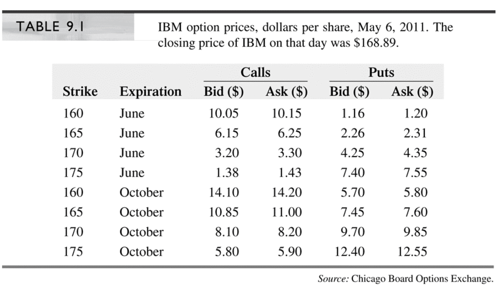

# Section 9.1: Put-Call Parity

## Chapter 9

\LARGE Parity and Other Option Relationships

## IBM Option Quotes

## Put-Call Parity

\begin{itemize}
    \item For European options with the same strike price and time to expiration the parity relationship is
        \begin{itemize}
            \item[] $\mbox{Call} - \mbox{put} = PV(\mbox{forward price} - \mbox{strike price})$
            \item[]
            \item[] $\quad \quad \quad \quad \quad \quad \mbox{or}$
            \item[]
            \item[] $C(K,T) - P(K,T) = PV_{0,T}(F_{0,T} - K) = e^{-rT} (F_{0,T} - K)$
        \end{itemize}
    \item[]
    \item Intuition
        \begin{itemize}
            \item Buying a call and selling a put with the strike equal to the forward price $(F_{0,T} = K)$ creates a synthetic forward contract and hence must have a zero price
        \end{itemize}
\end{itemize}

## Parity for Options on Stocks

\begin{itemize}
    \item If underlying asset is a stock and PV0,T(Div) is the present value of the dividends payable over the life of the option, then e-rT F0,T = S0 – PV0,T (Div), therefore
    \item[]
    \item Rewriting above
    \item[]
    \item For index options,                              , therefore
\end{itemize}
